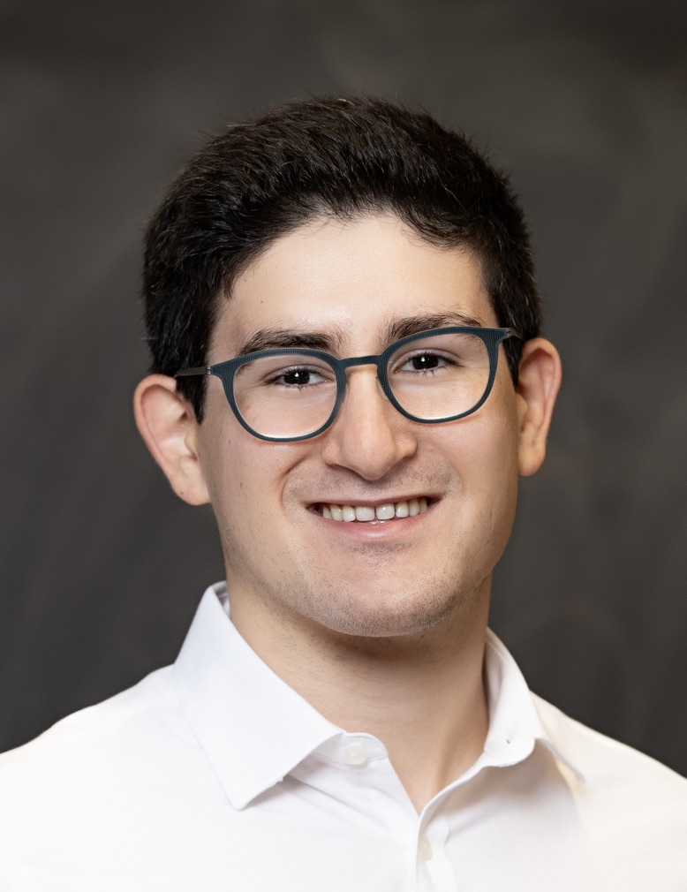

::: {.hero}
::: {.hero-copy}

PhD candidate in mathematics

# Ron Nissim

Department of Mathematics Massachusetts Institute of Technology

I am a fifth-year PhD student in the [MIT Department of Mathematics](https://math.mit.edu), advised by [Scott Sheffield](https://math.mit.edu/~sheffield/). My research lies at the intersection of **probability theory** and **mathematical physics**. More specifically, I am interested in lattice Yang–Mills theory, lattice spin systems, and topics in random matrix theory, including Weingarten calculus and $\beta$-ensembles. I am currently on the job market for postdoctoral positions.

::: {.hero-actions}
[View my research](research.qmd){.button .button-primary}
[Download CV](files/Ron-Nissim-CV.pdf){.button .button-secondary}
:::
:::

::: {.portrait-card}

::: {.contact-list}
**Ron Nissim**  
rnissim at mit dot edu  
[Department of Mathematics](https://math.mit.edu)  
Massachusetts Institute of Technology  
Office 2-231A, Simons Building
:::

::: {.profile-links}
[GitHub](https://github.com/rn9801) · [MIT profile](https://math.mit.edu/directory/profile.html?pid=2422) · [CV](files/Ron-Nissim-CV.pdf)
:::
:::
:::

::: {.section-heading}

At a glance

## Research
:::

::: {.home-grid}
::: {.feature-card}
### Research interests

Probability theory and mathematical physics, especially questions arising from lattice gauge theory, lattice spin systems, and random matrix theory.
:::

::: {.feature-card}
### Latest paper

**“Deconfinement for $\mathrm{SO}(3)$ Lattice Yang–Mills at Strong Coupling”**  
Preprint · 2026

[arXiv](https://arxiv.org/abs/2605.16162) · [Abstract](research.qmd#paper-1)
:::
:::

::: {.callout-strip}
Looking for papers, abstracts, and preprints?
[Browse all research →](research.qmd)
:::

::: {.section-heading}

Background

## Education
:::

::: {.education-row}
::: {.education-item}
2022-present

### PhD in Mathematics

Massachusetts Institute of Technology  
Advisor: Scott Sheffield
:::

::: {.education-item}
2018-2022

### BA in Honors Mathematics

New York University
:::
:::
